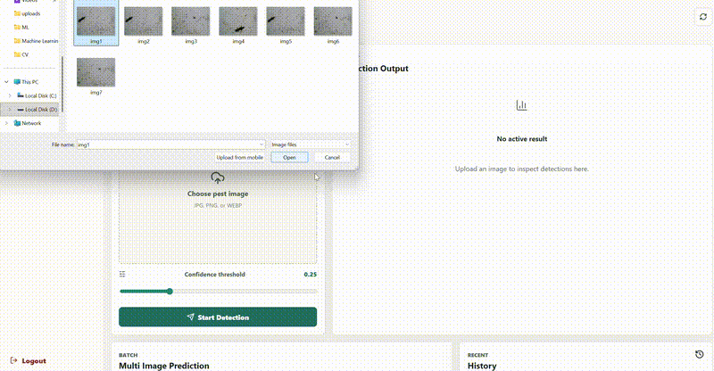
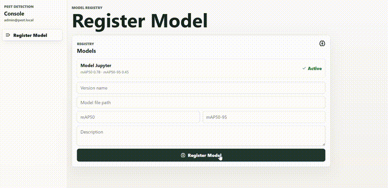

# Pest Detection

A pest detection system built with FastAPI, YOLOv8, Celery, and PostgreSQL. The backend exposes REST API endpoints for uploading images, running inference, and querying detection history and statistics. A background worker handles asynchronous detection tasks via Celery and Redis. A separate frontend application communicates with the API.

## Demo

### User



### Admin



## Project Structure

```
Pest-Detection/
├── assets/
├── backend/
│   ├── api/                  # Route handlers
│   ├── db/                   # Database engine and session setup
│   ├── example/              # Example requests or usage
│   ├── models/               # SQLAlchemy models
│   ├── monitoring/           # Monitoring integration
│   ├── schemas/              # Pydantic schemas
│   ├── services/             # Business logic and inference services
│   ├── uploads/              # Uploaded image storage
│   ├── utils/
│   ├── Dockerfile
│   ├── main.py               # FastAPI application entry point
│   ├── requirements.txt
│   ├── seed_admin.py         # Seed initial admin data
│   └── worker.py             # Celery worker entry point
├── frontend/
│   ├── src/
│   ├── index.html
│   ├── package.json
│   ├── package-lock.json
│   └── vite.config.js
├── grafana_dasboard/
│   └── dashboard-1780124503379.json
├── pest_detection_training/
│   ├── config/
│   ├── data/
│   ├── googlecolab/
│   ├── models/
│   ├── notebooks/
│   ├── utils/
│   └── requirements_training.txt
├── .env
├── .gitignore
├── .dockerignore
├── docker-compose.yml
└── LICENSE
```

## Prerequisites

- Python 3.10+
- Node.js 18+ (for the frontend)
- PostgreSQL
- Redis

### Backend dependencies

```
fastapi
uvicorn
sqlalchemy
psycopg2-binary
python-dotenv

torch
torchvision

ultralytics
cloudinary
python-multipart
celery
redis

grad-cam
opencv-python
matplotlib
httpx
prometheus-fastapi-instrumentator
prometheus-client

bcrypt==4.0.1
python-jose[cryptography]
passlib[bcrypt]
```

### Training dependencies

```
ultralytics
albumentations
jupyter
ipykernel
PyYAML
```

## Environment Variables

Copy `.env.example` to `.env` and fill in the required values:

```
POSTGRES_USER=
POSTGRES_PASSWORD=
POSTGRES_DB=
APP_PORT=8000
POSTGRES_PORT=5432
CLOUDINARY_CLOUD_NAME=
CLOUDINARY_API_KEY=
CLOUDINARY_API_SECRET=
```

## Backend

### Run with Docker (recommended)

This starts the FastAPI backend, Celery worker, PostgreSQL, and Redis together:

```bash
docker-compose up --build
```

The API will be available at `http://localhost:8000`.

### Run locally

#### Backend server

```bash
cd backend
pip install -r requirements.txt
pip install torch torchvision --index-url https://download.pytorch.org/whl/cpu
uvicorn main:app --reload
```

#### Seed admin data (optional)

```bash
python seed_admin.py
```

## Training

Training requires a CUDA-capable GPU. Install the nightly PyTorch build with CUDA 12.8 support before the rest of the dependencies:

```bash
pip install --pre torch torchvision torchaudio --index-url https://download.pytorch.org/whl/nightly/cu128
pip install -r requirements.txt
```

Training notebooks and scripts are located in the `pest_detection_training/` directory, organized into `notebooks/`, `config/`, `data/`, `models/`, and `utils/`. Google Colab notebooks are available under `googlecolab/`.

## Frontend

The frontend is a Vite-based application located in the `frontend/` directory. Navigate to it, then install dependencies and start the development server:

```bash
cd frontend
npm install && npm run dev
```

## API Endpoints

### Authentication

| Method | Path | Description |
|--------|------|-------------|
| POST | `/auth/register` | Register a new account |
| POST | `/auth/verify-register-otp` | Verify OTP sent after registration |
| POST | `/auth/login` | Login and receive access token |
| GET | `/auth/me` | Get current authenticated user info |
| POST | `/auth/forgot-password` | Request a password reset OTP |
| POST | `/auth/reset-password` | Reset password using OTP |

### Prediction (User only)

| Method | Path | Description |
|--------|------|-------------|
| POST | `/predict/` | Upload a single image and dispatch detection |
| GET | `/predict/{detection_id}` | Get result of a single detection |
| POST | `/predict/batch` | Upload up to 10 images as a batch |
| GET | `/predict/batch/{batch_id}` | Get status and progress of a batch |
| GET | `/predict/batch/{batch_id}/summary` | Get aggregated summary of a finished batch |

### History (User only)

| Method | Path | Description |
|--------|------|-------------|
| GET | `/history/` | Get recent detection history (default 20, max 100) |

### Model Registry (Admin only)

| Method | Path | Description |
|--------|------|-------------|
| POST | `/models/` | Register a new model version |
| GET | `/models/` | List all model versions |
| PATCH | `/models/{version_id}/activate` | Activate a specific model version |

### Statistics

| Method | Path | Description |
|--------|------|-------------|
| GET | `/stats/` | Get total images, total pests, and breakdown by pest type |

## Monitoring

The backend exposes metrics via `prometheus-fastapi-instrumentator` (for HTTP metrics) and custom Prometheus counters/histograms in the worker (for inference and Celery task metrics). Metrics are scraped by Prometheus and visualized in Grafana.

A pre-built Grafana dashboard is available at `grafana_dasboard/dashboard-1780124503379.json`. Import it into your Grafana instance and point it to your Prometheus datasource.

The dashboard includes 8 panels:

| Panel | Description |
|-------|-------------|
| Request Rate | HTTP request rate to the backend (`http_requests_total`) |
| Latency p95 | 95th percentile HTTP request duration (`http_request_duration_seconds`) |
| Inference Time | 95th percentile YOLOv8 inference duration per task (`inference_duration_seconds`) |
| Pest by Type | Total pest detections broken down by type — thin, round, big (`pest_detected_total`) |
| Detection Rate | Rate of images with vs without pest detections (`detection_with_pest_total`, `detection_without_pest_total`) |
| Celery Tasks | Rate of Celery task successes and failures (`celery_task_success_total`, `celery_task_failed_total`) |
| Task Duration | 95th percentile Celery task duration (`celery_task_duration_seconds`) |
| Confidence Dist | Distribution of detection confidence scores (`detection_confidence_score`) |

### Import dashboard

1. Open Grafana and go to Dashboards > Import
2. Upload `grafana_dasboard/dashboard-1780124503379.json`
3. Select your Prometheus datasource and click Import

## Tech Stack

- FastAPI — REST API framework
- YOLOv8 (Ultralytics) — object detection model
- Celery + Redis — asynchronous task queue
- PostgreSQL + SQLAlchemy — database
- Cloudinary — image storage
- Grafana — monitoring dashboard
- Docker — containerization